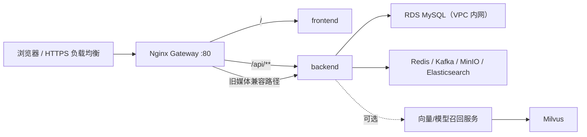

# RanGwaz / Vibelo

RanGwaz 当前产品名是 Vibelo，目标是搭建一个类似 Pinterest 的图片内容与推荐系统平台。核心内容主表是 `images`，图片文件首发阶段放 MinIO，业务数据在本地开发时使用 MySQL、公网默认使用阿里云 RDS MySQL，行为事件进入 Kafka，图片向量放 Milvus。

## 当前架构

- 前端：`frontend`，React + Vite。
- 后端：`backend`，Spring Boot + MyBatis。
- 本地中间件：MySQL、Redis、Kafka、MinIO、Milvus，统一由 `infra/docker-compose.yml` 启动；公网 Compose 默认不启动 MySQL，而是连接 RDS 内网地址。
- 数据工具：`tools/import_images.py` 导入授权图片，`tools/auto_label_images.py` 本地 GPU 打标签，`tools/vectorize_images.py` 本地 GPU 生成图片向量并写入 Milvus。

## 本地启动

所有中间件使用一个 compose 文件：

```powershell
docker compose -f infra/docker-compose.yml up -d
```

后端：

```powershell
cd backend
mvn spring-boot:run
```

前端：

```powershell
cd frontend
npm install
npm run dev
```

### 本地发布前验收（不构建镜像）

修改完成后先在本机执行以下检查。当前阶段不要运行 `docker build`、`docker compose build` 或公网 Compose 的 `up --build`：

```powershell
cd backend
mvn test

cd ..\frontend
npm run build

cd ..
$env:SPRING_DATASOURCE_URL="jdbc:mysql://rds-internal.example:3306/rangwaz_image_dev?sslMode=PREFERRED"
$env:SPRING_DATASOURCE_USERNAME="validation-only"
$env:SPRING_DATASOURCE_PASSWORD="validation-only"
$env:MINIO_ACCESS_KEY="validation-only"
$env:MINIO_SECRET_KEY="validation-only"
$env:APP_AUTH_TOKEN_SECRET="validation-only-token-secret-at-least-32-characters"
docker compose -f infra/docker-compose.public.yml config --quiet
```

上述最后一条只展开并校验部署配置，不会构建或启动镜像。本地功能联调继续使用 `infra/docker-compose.yml`、`mvn spring-boot:run` 和 `npm run dev`。

## 公网单入口架构

公网部署定义在 `infra/docker-compose.public.yml`，Nginx 是唯一对外入口：



- 当前 7.1 GiB 首发服务器运行单前端、单后端；Nginx 仍是唯一入口并保留以后水平扩容能力。
- `/api/**` 去掉 `/api` 前缀后进入 Spring Boot；验证码接口另有限流。
- `/` 进入无状态的前端 Nginx 容器。
- RDS 只走 VPC 内网地址并仅放行 ECS 私网 IP；Redis、Kafka、MinIO、Elasticsearch 和 Milvus 只在容器网络或 `127.0.0.1` 监听，不暴露公网。
- `POST /images` 与 `POST /media/upload` 分别由 `APP_FEATURE_PUBLISHING_ENABLED=false`、`APP_FEATURE_MEDIA_UPLOAD_ENABLED=false` 强制拒绝；前端 `/publish` 永久重定向首页，个人资料页只保留昵称和简介编辑，当前不启动图片检测服务。
- TLS 最快可放在云负载均衡/CDN，回源到此 Nginx 的 80 端口。公网安全组只开放 80/443。

只有决定正式上线时才生成未跟踪的 `.env.public`。公网发布采用离线、不可变 release：在本机已提交全部跟踪变更且前后端没有未跟踪构建输入的完整 40 位 Git SHA 上，用 `--pull=false --platform linux/amd64` 构建带 `org.opencontainers.image.revision` 标签的 Backend/Frontend commit 镜像，再由 `Export-PublicImageBundle.ps1` 连同固定运行镜像导出并在 ECS 上校验导入；PyMySQL 1.1.2 wheel 单独离线传输。ECS 不构建、不拉取、不在线安装 Python 包，所有 `up` 都使用 `--no-build --pull never` 和显式服务名。完整命令见部署手册第 9 节。

完整的域名、TLS、数据迁移、首次发布、验收、更新与回滚步骤见 [公网部署与 Nginx 网关](docs/公网部署与Nginx网关.md)。

公网目标系统是 Ubuntu Server 26.04 LTS 64 位。服务器必须先按手册安装 Docker、设置 `vm.max_map_count=1048576`、增加 4 GB 应急 Swap，并保持 `recommendation` profile 关闭。

当前 160 GB ECS 数据盘应格式化并挂载到 `/data`，再把 Docker `data-root` 迁到 `/data/docker`、把 Docker 29 使用的 containerd 数据目录迁到 `/data/containerd`；这不会改变 40 GB 系统盘 `/` 的容量。首发可继续使用数据盘上的 MinIO，暂不强制购买 OSS/CDN；正式扩大图片流量时再迁移到 OSS，并用 CDN 分发静态图片。完整判断和安全操作顺序见 [公网部署与 Nginx 网关](docs/公网部署与Nginx网关.md)。

上线操作已拆成可审计工具，优先按各目录中的 README 执行，不要手工拼接含密码的命令：

- [ECS 环境配置与只读预检](ops/public/README.md)
- [MySQL 8.4 → RDS MySQL 8.0.36 安全迁移](ops/migration/mysql/README.md)
- [Windows MinIO → ECS MinIO 流式迁移与校验](ops/migration/minio/README.md)

固定顺序是：挂载数据盘并迁移 Docker 数据目录 → 创建 `vibelo_app` 标准 RDS 账号 → 生成 `.env.public` 并预检 → 本机导出和 MySQL 8.0.36 恢复演练 → 导入空 RDS 并精确验收 → 启动目标 MinIO → 流式迁移并校验对象 → 本机构建并导出 full-SHA 离线镜像 release，同时准备固定 PyMySQL wheel → ECS 校验导入 → 只读验收既有 MinIO → 只启动 Elasticsearch → 重建、认证并原子发布搜索索引 → 启动 Redis/Zookeeper/Kafka → 启动 Backend/Frontend → 最后启动 Nginx Gateway。首发不启用 `local-database` 或 `recommendation` profile，也不要执行 `docker compose down -v`。

后端默认不再自动创建开发账号。如果本地空库确实需要初始化一个账号，必须显式设置 `APP_DATA_INITIALIZER_ENABLED=true`、`APP_DATA_INITIALIZER_USERNAME`和 `APP_DATA_INITIALIZER_PASSWORD`；公网 Compose 固定关闭该功能。

## 本地开发中间件端口

- MySQL：`localhost:3306`
- Redis：`localhost:6379`
- Kafka：`localhost:9092`
- 业务 MinIO：`localhost:9000`，控制台 `localhost:9001`
- Milvus：`localhost:19530`
- Milvus 内部 MinIO：`localhost:19000`，控制台 `localhost:19001`

业务 MinIO 和 Milvus 内部 MinIO 是两个容器，职责不同，但都在同一个 compose 文件里。

## 数据库

开发库 schema：

```text
backend/src/main/resources/db/schema.sql
```

字段变更和新增表通过 Flyway SQL migration 管理：

```text
backend/src/main/resources/db/migration
```

后端不会自动清空数据库，`spring.sql.init.mode` 已设为 `never`。

## 图片导入

安装依赖：

```powershell
python -m pip install pymysql minio pycryptodome pillow
```

运行：

```powershell
python tools/import_images.py
```

脚本默认读取：

```text
tools/downloaded_dataset/images
```

## 自动打标签

推荐先在项目目录内创建本地 GPU Python 环境，依赖、缓存和模型都放在 `tools` 下，避免写到 C 盘：

```powershell
.\tools\setup_local_gpu.ps1
```

如果需要走本机 12000 代理，且想明确使用非 C 盘的 Python：

```powershell
.\tools\setup_local_gpu.ps1 -Python "D:\Python316\python.exe" -ProxyUrl "http://127.0.0.1:12000"
```

下载本地模型：

```powershell
.\tools\.venv\Scripts\python.exe tools\download_local_models.py
```

如果 Hugging Face 需要走本机 12000 代理，Ollama 模型已成功时可只续下向量模型：

```powershell
.\tools\.venv\Scripts\python.exe tools\download_local_models.py --skip-label --use-hf-proxy --hf-proxy-url http://127.0.0.1:12000
```

默认模型：

```text
打标签: qwen3-vl:8b                 -> tools/models/ollama
取向量: google/siglip2-base-patch16-224 -> tools/models/huggingface
```

批量打标签：

```powershell
.\tools\.venv\Scripts\python.exe tools\auto_label_images.py
```

如果本机显存/内存不够跑 Qwen-VL，用云端 OpenAI-compatible 视觉模型：

```powershell
.\tools\run_cloud_label.ps1 -InitConfig
# edit tools\cloud_label_config.local.ps1 and replace sk-your-api-key
.\tools\run_cloud_label.ps1
```

结果写入 `images.description`、`images.main_category_id`、`categories`、`tags` 和 `image_tags`。

## 图片向量与推荐召回

推荐依赖已由 `tools/setup_local_gpu.ps1` 安装到项目内虚拟环境。单独补装时也使用该虚拟环境：

```powershell
.\tools\.venv\Scripts\python.exe -m pip install -r tools\requirements_recommendation.txt
```

本地 GPU 生成图片向量：

```powershell
.\tools\.venv\Scripts\python.exe tools\vectorize_images.py
```

不要用 `G:\Anaconda\envs\DL\python.exe` 跑向量脚本；那个环境的 `transformers` 太旧，不认识 SigLIP2。

启动向量召回服务：

```powershell
.\tools\.venv\Scripts\python.exe tools\vector_recall_service.py
```

当前向量配置：

```text
model: google/siglip2-base-patch16-224
version: siglip2-base-p224-d512-v1
dimension: 512
collection: vibelo_image_vectors_siglip2_base_p224_d512
```

首页走推荐召回和排序，详情页周围数据优先走当前图片的向量相似召回，再用标签、分类、比例和热度做辅助排序。

### 学习型双塔召回

`tools/train_two_tower_recall.py` 会从真实 next-positive 行为训练序列用户塔与共享图片投影，并生成版本化 candidate。`tools/publish_two_tower_index.py` 负责构建、校验 learned Milvus collection，再把 candidate promote 为 current。数据不足或模型异常时，在线服务自动回退到现有多兴趣 SigLIP 召回。

`tools/train_recommendation_recall.py` 仅调优启发式 fallback 的行为权重，不是神经召回模型训练脚本。

生产训练、建索引和切流可使用带安全门禁的一键流水线：

```powershell
.\tools\run_two_tower_pipeline.ps1 `
  -ModelDir "D:\vibelo-data\recommendation-models"
```

#### 版本注册中心怎么运作

`tools/two_tower_registry.py` 维护 `${VIBELO_RECOMMENDATION_MODEL_DIR}/two_tower/registry.json`，它不是模型文件，而是线上模型状态的唯一控制面：

- `candidate`：训练完成且离线门禁通过，但尚未接流量的新版本。
- `current`：在线模型服务唯一允许加载的版本。
- `previous`：上一个稳定版本，供一键回滚。
- 每个版本记录 checkpoint、manifest、SHA-256、向量维度、Milvus collection 与索引状态；加载前会重新校验，防止模型文件和索引串版本。
- promote 时先把旧 `current` 移到 `previous`，再把 READY 的 `candidate` 切成 `current`。在线服务监听 registry 修改时间并热加载；失败时保留旧模型并回退到 SigLIP 多兴趣召回。

#### 安全训练流水线怎么运作

`tools/run_two_tower_pipeline.ps1` 是训练、发布、切流的串行闸门：

1. 获取单实例锁，避免两个定时任务同时训练或发布。
2. 用真实 next-positive 行为训练用户塔和共享图片投影。
3. 检查至少 50 个有效 actor、500 条样本，以及 validation/test `Recall@50 >= 0.01`。
4. 只把通过门禁的版本登记为 `candidate(PENDING)`，训练脚本不能直接覆盖 `current`。
5. 调用 Milvus 发布器全量建新 collection，并完成 checksum、维度、实体数和向量范数校验。
6. 只有索引状态变为 `READY` 才 promote；任一步失败都立即停止，线上 `current` 不变。

当前真实行为不足时流水线失败是正常保护，不要降低阈值或用伪造数据绕过。网站先使用 fallback 上线收集曝光、点击、长浏览、点赞、收藏和评论，之后定时重跑即可。

#### Milvus 发布器怎么运作

`tools/publish_two_tower_index.py` 从原始 SigLIP 512 维 collection 读取所有已发布图片向量，经过候选版本的共享图片塔投影为 256 维，再创建一个带版本号的新 HNSW/COSINE collection。它不会原地覆盖当前 collection，也不会删除 registry 仍引用的 `current` 或 `previous`。

发布器先支持 `--dry-run` 做只读预检；正式构建后校验模型 SHA、输入/输出维度、预期实体数、抽样 L2 范数和索引可加载性，再把 candidate 的索引标记为 `READY`。因此“训练成功”“索引构建成功”“正式切流”是三个分离的步骤，任何半成品都不会被在线服务读取。

完整的训练门禁、candidate/current/previous、dry-run、定时任务、健康检查和回滚命令见 [推荐模型训练与发布](docs/训练模型文档.md)，公网部署见 [公网运行清单](docs/public-runtime.md)。

更多数据处理和向量化说明见 [数据标注与向量化](docs/data-labeling-and-vectorization.md)。

## 手机号登录与短信

前端登录弹窗已支持手机号验证码登录。单一配置默认调用真实阿里云短信；本地需要固定验证码时显式设置 `APP_SMS_MOCK=true`。同时兼容 `ALIYUN_SMS_*` 与旧的 `ALIYUN_PNVS_SMS_*` 变量名。

短信服务配置说明见：

```text
docs/sms-login.md
```

## 图片安全审核服务（首发暂不启用）

首发阶段 `APP_FEATURE_PUBLISHING_ENABLED=false`、`APP_FEATURE_MEDIA_UPLOAD_ENABLED=false`、`CONTENT_SAFETY_ENABLED=false`。前端没有发布入口或个人图片上传控件，后端同时拒绝创建图片内容和媒体上传，因此不需要启动 8093 图片检测服务。下面的配置只在以后重新开放用户图片写入时使用。

安装依赖：

```powershell
python -m pip install fastapi uvicorn pillow
```

启动审核服务：

```powershell
.\tools\run_image_moderation_service.ps1
```

健康检查：

```text
http://127.0.0.1:8093/health
```

后端启用本地审核服务：

```powershell
$env:CONTENT_SAFETY_CLOUD_ENABLED="true"
$env:CONTENT_SAFETY_CLOUD_PROVIDER="local-model"
$env:CONTENT_SAFETY_MODEL_URL="http://127.0.0.1:8093/moderate/image"
cd backend
mvn spring-boot:run
```

默认 `heuristic` 模式只依赖 Pillow，适合本地快速挡明显裸露、血腥风险：

```powershell
$env:VIBELO_IMAGE_MODERATION_MODE="heuristic"
.\tools\run_image_moderation_service.ps1
```

如果本机已安装 Ollama 和视觉模型，可以切到开源视觉模型辅助判断：

```powershell
$env:VIBELO_IMAGE_MODERATION_MODE="ollama"
$env:VIBELO_IMAGE_MODERATION_MODEL="qwen3-vl:8b"
.\tools\run_image_moderation_service.ps1
```

常见日志说明：

- `GET / 200 OK`：浏览器打开审核服务根路径，正常。
- `GET /favicon.ico 404`：浏览器找图标，忽略。
- `Unsupported upgrade request`：旧版后端 HTTP 客户端或浏览器扩展可能触发；后端已强制本地审核请求走 HTTP/1.1。
- `missing imageBase64`：审核服务没有收到图片字段，通常是后端没重启到最新代码，或请求不是从后端上传链路发出。

如果以后使用阿里云内容安全，要求阿里云能访问图片公网地址或使用 OSS 对象方式。没有公网域名时不要切 `aliyun`，继续使用 `local-model`。

```powershell
$env:CONTENT_SAFETY_CLOUD_PROVIDER="aliyun"
$env:APP_STORAGE_MINIO_OBJECT_URL_PREFIX="https://你的域名/media/object"
```

## 大文件和本地结果文件

以下运行结果文件只保留在本地，不要提交到 Git：

```text
tools/cloud_label_results.jsonl
tools/auto_label_results.jsonl
tools/import_results.jsonl
```

`.gitignore` 已忽略这些文件；如果某个文件已经被 Git 跟踪，需要先从索引移除：

```powershell
git rm --cached tools/cloud_label_results.jsonl
```
