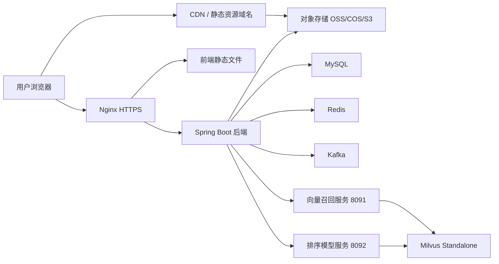

# Vibelo 公网部署方案

> 适用日期：2026-07-05  
> 目标：先用一套成本可控、能收集真实用户行为数据的公网部署，把图片资源从服务器磁盘迁到对象存储；后续再逐步升级数据库、消息队列和推荐服务。

## 结论

推荐先走 **单台云服务器 + 云对象存储 + 可选 CDN** 的方案。

不要把 12 万多张图片继续放服务器硬盘，也不要把 MinIO 当公网主存储长期用。MinIO 适合本地开发和内网私有化，公网生产更适合用云厂商对象存储，例如阿里云 OSS、腾讯云 COS、AWS S3、Cloudflare R2 等。

结合你现在已经在用阿里云 DashScope，且用户大概率在国内，第一版最省心的组合是：

- 云服务器：阿里云 ECS 或轻量服务器，先不上 GPU。
- 图片存储：阿里云 OSS，图片原图和缩略图都放 OSS。
- 图片访问：OSS 绑定 CDN 域名，前端直接加载 CDN 图片。
- 后端：Spring Boot 单服务。
- 前端：Vite 构建后的静态文件，由 Nginx 或对象存储静态站点托管。
- 数据库：预算紧先 Docker MySQL；更稳则直接 RDS MySQL。
- Redis：先 Docker Redis。
- Kafka：第一版可继续 Docker 单节点，只开放内网；后续再换托管消息队列或改成数据库事件表。
- Milvus：第一版可以单机 standalone。它存的是向量索引，不是原图，不需要 GPU。
- Python 推荐服务：`vector_recall_service.py` 和 `recommendation_model_service.py` 跑 CPU 即可。

公网首发阶段先做功能收口：页面只保留首页主入口，发现页和发布页不对外展示；发布接口默认关闭；上传接口必须登录后才能调用。第一版重点是稳定浏览、搜索、登录、点赞、收藏、评论、关注和行为数据收集，发布功能等公网稳定后再逐步开放。

## 当前系统拆解

当前项目主要由这些组件组成：

| 模块 | 当前实现 | 公网部署建议 |
| --- | --- | --- |
| 前端 | React + Vite | 构建成静态文件，Nginx 托管或对象存储静态托管 |
| 后端 | Spring Boot + MyBatis | 云服务器 Docker 或 systemd 运行 |
| MySQL | Docker MySQL 8.4 | 初期可同机，正式推广建议 RDS |
| Redis | Docker Redis | 初期同机即可 |
| Kafka/Zookeeper | Docker 单节点 | 初期同机，仅内网；后续替换托管队列 |
| 图片存储 | MinIO | 生产迁到 OSS/COS/S3/R2 |
| 图片访问 | 后端 `/media/object/**` 代理读取 MinIO | 改成直接返回对象存储/CDN URL，避免后端扛图片流量 |
| Milvus | standalone + etcd + 内部 MinIO | 初期同机；向量数据单独挂数据盘备份 |
| 向量召回 | Python FastAPI `8091` | 同机内网监听，不直接暴露公网 |
| 模型排序 | Python FastAPI `8092` | 默认关闭或灰度开启，不直接暴露公网 |
| 打标签/向量化 | 本地脚本 | 继续在本地跑，产物同步到云端数据库和 Milvus |
| 公网发布功能 | 已做功能开关 | 默认关闭 `POST /images`，后续确认审核、限流、风控后再打开 |
| 媒体上传 | 登录后可上传 | 当前用于头像和背景图，不允许匿名调用 |

## 推荐架构



重要原则：

- 图片流量不要经过 Spring Boot。图片文件直接走 OSS/CDN。
- 后端只负责签名上传、写数据库、鉴权、推荐、行为收集。
- 数据库、Redis、Kafka、Milvus 都只监听内网或 `127.0.0.1`，不要开公网端口。
- GPU 不放在云服务器上。打标签和向量化继续本地跑，或者未来另开临时 GPU 机器跑批处理。

## 当前公网首发收口状态

当前代码已经按首发公网策略做了收口：

- 主导航只保留首页。
- `/discover` 和 `/publish` 会重定向到 `/home`。
- 顶部搜索仍保留，搜索结果展示在 `/home?q=关键词`，不再单独暴露发现页。
- 账户菜单、左侧栏、个人资料页里的发布按钮已隐藏。
- 后端 `POST /images` 默认关闭，未开启时返回“发布功能暂未开放”。
- 后端 `/media/upload` 必须携带登录态，避免匿名上传。
- 主题切换支持浅色、深色、跟随系统，属于前端本地偏好，不依赖后端。
- 前端请求支持 `VITE_API_BASE`，公网推荐构建时设为 `/api`。

如果以后要恢复用户发布，至少先补齐这些前置条件：

1. 上传和发布限流。
2. 图片和文字安全审核稳定可用。
3. 发布后的审核状态、失败原因和用户通知链路完整。
4. 对象存储写入和 CDN 图片地址已经稳定。
5. 管理端或自动化审核后台能追踪异常内容。
6. 再把 `APP_FEATURE_PUBLISHING_ENABLED` 改成 `true`，并恢复前端发布入口。

## 服务器规格建议

### 第一阶段：公网内测

适合目标：先上线、能登录、能刷首页、能收集行为数据。

建议规格：

- CPU：4 vCPU
- 内存：16 GB
- 系统盘：80-100 GB
- 数据盘：200-500 GB ESSD
- 带宽：5-10 Mbps 起步，图片走 OSS/CDN 后服务器带宽压力不大

这台机器跑：

- Spring Boot
- Nginx
- MySQL
- Redis
- Kafka/Zookeeper
- Milvus standalone
- Python recall/ranker 服务

如果 Milvus、Kafka、MySQL 同机后内存紧张，优先升级到 8 vCPU / 32 GB，而不是买 GPU。

### 第二阶段：开始有真实流量

当你开始有稳定用户行为数据、图片访问量上升后，建议拆成：

- ECS 1：后端、Nginx、Python 推荐服务
- RDS MySQL：业务库
- Redis 托管版或单独 Redis 实例
- OSS + CDN：图片
- Milvus：仍可自建，但迁到独立 ECS 或托管向量数据库

### 第三阶段：正式生产

正式生产再考虑：

- 负载均衡 SLB
- 多台后端实例
- 托管消息队列替换 Kafka 单节点
- RDS 高可用
- 自动备份和异地备份
- 对象存储生命周期规则
- 灰度发布和监控告警

## 图片存储方案

### 为什么不建议服务器硬盘存图片

你现在有 12 万多张图片，后面还会继续增加。如果放 ECS 硬盘：

- 扩容麻烦，磁盘满了会影响数据库和服务。
- 备份成本高。
- 图片访问会吃服务器带宽。
- 图片文件和业务服务耦合，迁移困难。

对象存储更适合：

- 按容量付费。
- 可绑定 CDN。
- 原图、缩略图、后续视频资源都能统一管理。
- 服务器重装或迁移不会影响图片。

### 推荐对象结构

建议统一对象 key：

```text
originals/yyyy/mm/dd/{uuid}.{ext}
thumbs/yyyy/mm/dd/{uuid}.jpg
imports/{dataset}/{hash}.{ext}
```

数据库里的字段建议保持：

```text
images.object_key     -> originals/yyyy/mm/dd/xxx.jpg
images.file_url       -> https://img.your-domain.com/originals/...
images.thumbnail_url  -> https://img.your-domain.com/thumbs/...
```

### 当前代码需要改的点

现在 [MediaServiceImpl.java](../backend/src/main/java/com/rangwaz/imagesite/service/impl/MediaServiceImpl.java) 仍然是 MinIO 客户端，并且 `publicUrl()` 返回 `/media/object/{key}`，这会让图片经过后端读取：

```text
浏览器 -> Spring Boot -> MinIO -> Spring Boot -> 浏览器
```

公网生产建议改成：

```text
浏览器 -> OSS/CDN
```

需要做两步：

1. 上传仍由后端处理，后端把图片写到 OSS/COS/S3。
2. `file_url` 和 `thumbnail_url` 直接写 CDN URL，例如 `https://img.example.com/thumbs/...`。

如果第一版不想马上改 SDK，也可以先保留 MinIO 接口抽象，新增一个 `ObjectStorageService`：

- `MinioMediaStorage`：本地开发用。
- `AliyunOssMediaStorage` 或 `S3MediaStorage`：公网生产用。

## 数据库和中间件方案

### MySQL

第一版可以同机 Docker MySQL，但必须满足：

- 独立数据盘。
- 每日备份。
- 开启 binlog 或至少每日 `mysqldump`。
- 只允许本机或内网访问，安全组不要开放 `3306` 到公网。

更推荐生产直接用 RDS MySQL：

- 自动备份。
- 故障恢复更简单。
- 后续扩容更稳。

### Redis

第一版 Docker Redis 即可：

- 只监听内网。
- 设置密码。
- 开启 AOF 或定时 RDB。

Redis 当前主要用于缓存和会话类能力，丢失的风险比 MySQL 小。

### Kafka

当前行为链路是：

```text
前端行为 -> Spring Boot -> Kafka -> Consumer -> user_behaviors/feed_impressions
```

公网第一版可以继续单节点 Kafka，但要知道：

- 单节点 Kafka 不算高可用。
- 它比较吃内存。
- 不能暴露公网端口。

如果想省内存，后续可以把第一版行为写入改成：

```text
Spring Boot -> user_behavior_events 表 -> 后台任务批量入 user_behaviors
```

这样可以先省掉 Kafka/Zookeeper，等流量大了再上消息队列。

## 推荐系统部署

### 不需要 GPU 的部分

公网实时服务不需要 GPU：

- Spring Boot 推荐聚合逻辑
- Milvus 向量检索
- `tools/vector_recall_service.py`
- `tools/recommendation_model_service.py`
- LightGBM/Sklearn 类排序模型推理

### 需要 GPU 或云模型的部分

这些继续离线跑：

- 云端 VLM 打标签：`tools/run_cloud_label.ps1`
- 本地 GPU/CPU 向量化：`tools/vectorize_images.py`
- 排序模型训练：`tools/train_recommendation_ranker.py`

第一版可以这样走：

1. 本地继续完成标签和向量。
2. 把 MySQL 数据导入云端 MySQL。
3. 把 Milvus collection 在云端重建或迁移。
4. 云端只跑召回和排序服务。

## 域名、HTTPS 和备案

如果服务器在中国大陆，并且使用自有域名对外提供网站，通常需要做 ICP 备案。官方入口是 [工业和信息化部政务服务平台 ICP/IP 地址/域名信息备案管理系统](https://beian.miit.gov.cn/)。

建议域名规划：

```text
www.example.com      -> 前端页面
api.example.com      -> 后端 API
img.example.com      -> OSS/CDN 图片
```

也可以第一版只用一个域名：

```text
example.com          -> 前端
example.com/api      -> 后端
example.com/media    -> 临时兼容旧媒体路径
```

但长期更推荐把图片域名独立出来。

## Nginx 建议

第一版 Nginx 做三件事：

- HTTPS 证书。
- 前端静态文件。
- API 反向代理到 Spring Boot。

示例路由：

```nginx
server {
    listen 443 ssl http2;
    server_name www.example.com;

    root /opt/vibelo/frontend/dist;
    index index.html;

    location / {
        try_files $uri $uri/ /index.html;
    }

    location /api/ {
        proxy_pass http://127.0.0.1:8080/;
        proxy_set_header Host $host;
        proxy_set_header X-Real-IP $remote_addr;
        proxy_set_header X-Forwarded-For $proxy_add_x_forwarded_for;
        proxy_set_header X-Forwarded-Proto $scheme;
    }
}
```

当前前端已经支持通过 `VITE_API_BASE` 统一 API 前缀。公网推荐使用 `/api`，这样 Nginx 只需要代理 `/api/**`，前端静态路由和后端接口边界更清楚。

前端公网构建时设置：

```bash
VITE_API_BASE=/api npm run build
```

如果用 PowerShell：

```powershell
$env:VITE_API_BASE="/api"
npm run build
```

本地开发可以不设置 `VITE_API_BASE`，前端仍会按根路径请求后端。

## 环境变量和配置

公网不要把密码写在 `application.yml` 里。建议用环境变量覆盖：

```yaml
spring:
  datasource:
    url: ${SPRING_DATASOURCE_URL}
    username: ${SPRING_DATASOURCE_USERNAME}
    password: ${SPRING_DATASOURCE_PASSWORD}
  data:
    redis:
      host: ${REDIS_HOST:127.0.0.1}
      port: ${REDIS_PORT:6379}
      password: ${REDIS_PASSWORD:}
  kafka:
    bootstrap-servers: ${KAFKA_BOOTSTRAP_SERVERS:127.0.0.1:9092}

app:
  features:
    publishing-enabled: ${APP_FEATURE_PUBLISHING_ENABLED:false}
  recommendation:
    vector-service-url: ${VECTOR_SERVICE_URL:http://127.0.0.1:8091}
    model-service-url: ${MODEL_SERVICE_URL:http://127.0.0.1:8092}
  storage:
    minio:
      endpoint: ${OBJECT_STORAGE_ENDPOINT}
      access-key: ${OBJECT_STORAGE_ACCESS_KEY}
      secret-key: ${OBJECT_STORAGE_SECRET_KEY}
      bucket: ${OBJECT_STORAGE_BUCKET}
      object-url-prefix: ${OBJECT_PUBLIC_URL_PREFIX}
```

首发公网建议明确设置：

```bash
APP_FEATURE_PUBLISHING_ENABLED=false
CONTENT_SAFETY_CLOUD_ENABLED=true
CONTENT_SAFETY_CLOUD_PROVIDER=local-model
CONTENT_SAFETY_MODEL_URL=http://127.0.0.1:8093/moderate/image
```

短信如果要真实发送，关闭 mock：

```bash
APP_SMS_MOCK=false
```

如果前端和后端使用同一个域名，并通过 `/api` 反向代理，一般不需要额外开放 CORS。只有前端和后端分域名部署时，才需要把公网前端域名加入后端 CORS 白名单。

## 数据迁移步骤

### 1. 图片迁移

本地 MinIO 或本地图片目录迁到对象存储：

1. 建 OSS/COS bucket。
2. 上传 `originals/` 和 `thumbs/`。
3. 保持 object key 不变。
4. 批量更新 `images.file_url` 和 `images.thumbnail_url` 为 CDN URL。
5. 确认前端图片不再走 `/media/object/**`。

### 2. MySQL 迁移

本地导出：

```powershell
mysqldump -h 127.0.0.1 -P 3306 -u rangwaz -p --single-transaction --routines --triggers rangwaz_image_dev > vibelo.sql
```

云端导入：

```bash
mysql -h 127.0.0.1 -u rangwaz -p rangwaz_image_prod < vibelo.sql
```

导入后检查：

```sql
SELECT COUNT(*) FROM images;
SELECT COUNT(*) FROM image_tags;
SELECT COUNT(*) FROM image_embeddings;
SELECT COUNT(*) FROM user_behaviors;
```

### 3. Milvus 迁移

优先方案：在云端重新跑向量导入脚本，但不重新生成向量。

如果当前 `tools/vectorize_images.py` 只从图片重新算向量，建议先补一个导出/导入向量脚本，避免重复计算 12 万张图。

### 4. 前端发布

```bash
cd frontend
npm ci
export VITE_API_BASE=/api
npm run build
rsync -av dist/ /opt/vibelo/frontend/dist/
```

PowerShell 构建方式：

```powershell
cd frontend
npm ci
$env:VITE_API_BASE="/api"
npm run build
```

### 5. 后端发布

```bash
cd backend
mvn -DskipTests package
java -jar target/image-site-backend-0.0.1-SNAPSHOT.jar
```

正式建议用 systemd 或 Docker 管理进程。

## 安全清单

上线前必须做：

- 后端、MySQL、Redis、Kafka、Milvus 不开放公网端口。
- 只开放 `80`、`443`、必要的 SSH 端口。
- SSH 禁止密码登录，使用密钥。
- 所有数据库和对象存储密钥使用环境变量或云 Secret，不提交到 Git。
- Swagger UI 公网关闭或加访问限制。
- 管理后台、MinIO console、Milvus 端口不要暴露公网。
- `APP_FEATURE_PUBLISHING_ENABLED` 首发阶段保持 `false`。
- `/media/upload` 必须保持登录鉴权，不能匿名开放。
- 上传接口限制文件大小、类型、频率。
- 登录、短信、上传、评论、行为上报加限流。
- 对象存储 bucket 不直接全公开原图，至少通过 CDN 域名和防盗链控制。

## 备份策略

第一版最低要求：

- MySQL：每日备份，保留 7-14 天。
- 对象存储：开启版本控制或定期清单。
- Milvus：定期备份 collection 元数据和向量数据。
- 配置：`.env.production` 独立保存，不进 Git。
- 代码：Git 远程仓库。

## 监控指标

最低要看：

- ECS CPU、内存、磁盘、带宽。
- MySQL 连接数、慢查询、磁盘。
- Spring Boot `/actuator/health`。
- 首页 `/feed` 响应时间。
- 搜索 `/search` 响应时间和错误率。
- 图片 404 数量。
- 行为写入数量：`feed_impressions`、`user_behaviors` 每小时增量。
- Milvus recall 服务 `/health`。
- 本地图片审核服务 `8093` 可用性。
- OSS/CDN 流量和 4xx/5xx。

## 推荐实施顺序

### 第 0 步：先改代码

必须先完成：

- 媒体存储抽象化，支持 OSS/COS/S3。
- 前端 API base 已支持 `VITE_API_BASE`，公网构建设为 `/api`。
- 运行配置统一使用 `application.yml`，本地与公网差异全部通过环境变量覆盖。
- 关闭公网 Swagger 或加鉴权。
- 发布入口已隐藏，发布接口默认关闭。
- 上传接口已要求登录。

### 第 1 步：搭云资源

- 买 ECS。
- 建 OSS bucket。
- 建域名和证书。
- 做备案。
- 安装 Docker、Nginx、JDK、Node 构建环境。

### 第 2 步：迁数据

- 上传图片到 OSS。
- 导入 MySQL。
- 重建或迁移 Milvus。
- 启动 Redis、Kafka。

### 第 3 步：发布服务

- 发布 Spring Boot。
- 发布前端静态文件。
- 启动 Python recall/ranker。
- Nginx 接入 HTTPS。

### 第 4 步：灰度验证

检查：

- 首页能加载。
- 左侧导航只显示首页。
- 详情页能打开。
- `/discover` 和 `/publish` 会回到首页。
- 顶部搜索能在首页展示结果。
- 图片 URL 走 CDN/OSS。
- 登录正常。
- 点赞、收藏、评论正常。
- 关注、粉丝、关注列表正常。
- `user_behaviors` 有新增。
- `/feed` 不重复爆同一批图片。
- 未开启发布时，直接调用 `POST /images` 返回“发布功能暂未开放”。
- 未登录调用 `/media/upload` 会被拒绝。
- 关掉 `8091/8092` 时后端能降级。

## 成本判断

成本主要来自三块：

1. ECS：CPU、内存、数据盘、带宽。
2. 对象存储：存储容量、请求次数、外网流出流量。
3. CDN：图片访问流量。

对象存储的计费通常不只看“存了多少 GB”，还会看请求次数和流出流量。阿里云 OSS 官方计费说明见 [OSS Billing overview](https://www.alibabacloud.com/help/en/oss/product-overview/billing-overview)。ECS 的付费形态和计费项见 [ECS Billing overview](https://www.alibabacloud.com/help/en/ecs/product-overview/billing-overview)。

所以不要只看服务器硬盘价格。图片站真正烧钱的一般是图片外网流量，最好从一开始就上缩略图、CDN 缓存、防盗链和合理的图片尺寸。

## 不建议的方案

### 不建议一：所有图片放 ECS 硬盘

短期看省事，长期一定难维护。

### 不建议二：公网直接暴露 MinIO

MinIO console、bucket 权限、签名 URL、防盗链、带宽和备份都会变复杂。它适合作为内网服务，不适合作为你这个阶段的公网图片分发核心。

### 不建议三：一开始就买 GPU 服务器

你的公网实时服务不需要 GPU。GPU 钱应该花在离线跑批、训练或云模型调用上，而不是 24 小时挂着。

### 不建议四：一开始就上 Kubernetes

当前项目组件多，但流量还没起来。K8s 会增加运维复杂度。先用 Docker Compose/systemd，把边界理清楚，等流量和团队规模上来再迁。

## 最小上线版本

如果你想尽快上线，我建议最小版本只做到：

- ECS 4C16G。
- OSS + CDN 存图片。
- MySQL/Redis/Kafka/Milvus 同机 Docker。
- Spring Boot + Nginx 同机。
- Python recall 服务同机。
- 模型排序先关闭。
- 行为数据正常收集。

这个版本已经能满足：公网访问、真实用户数据收集、首页推荐继续迭代、图片不压爆服务器磁盘。

## 参考资料

- [阿里云 OSS Billing overview](https://www.alibabacloud.com/help/en/oss/product-overview/billing-overview)
- [阿里云 ECS Billing overview](https://www.alibabacloud.com/help/en/ecs/product-overview/billing-overview)
- [工信部 ICP/IP 地址/域名信息备案管理系统](https://beian.miit.gov.cn/)
